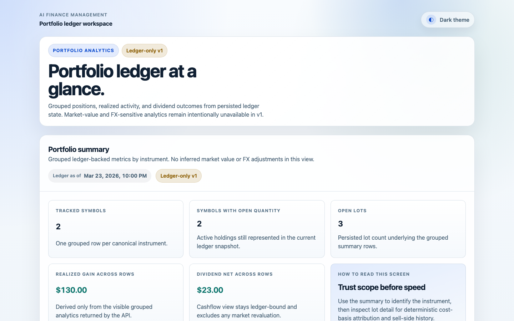
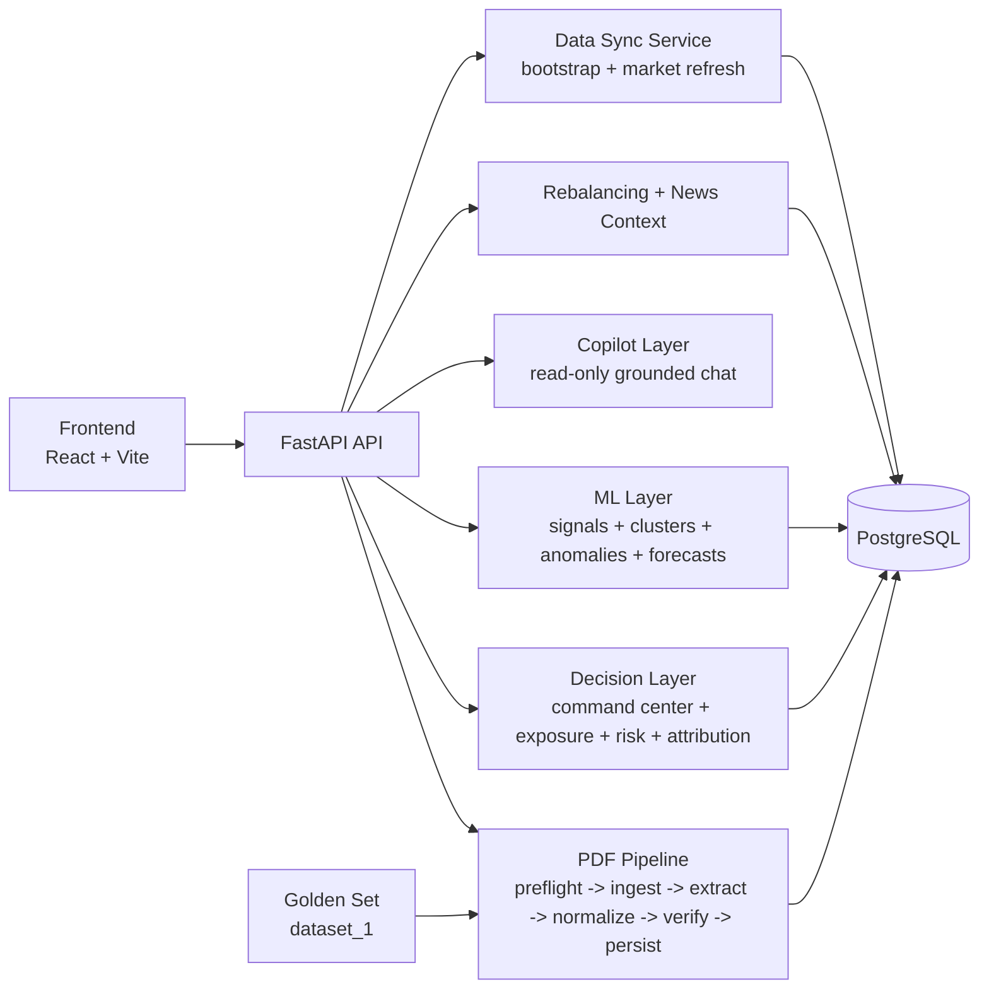
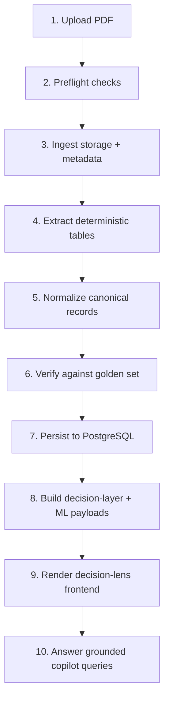

# AI Finance Management


[](https://github.com/nicolasenriquez/ai-finance-management/actions/workflows/ci.yml)

AI-native portfolio intelligence platform with a deterministic system of record:
PDF ingestion + canonical normalization + verification + persistence + decision-layer analytics + ML diagnostics + read-only copilot.



## Overview

AI Finance Management is a full-stack monorepo focused on deterministic financial data workflows plus an AI-native decision layer.

Current product direction:

- System of record: ingest broker PDFs and source data, normalize canonical transactions, validate against golden contracts, and persist durable ledger truth
- Decision layer: expose explainable portfolio APIs for command center, exposure, contribution, risk, rebalancing, and news context
- Copilot layer: provide read-only "chat with my portfolio" responses grounded on allowlisted analytics tools and evidence metadata

## Current Platform Status

| Area | Current Status |
|---|---|
| Phase | AI-native portfolio intelligence productization in active delivery |
| Backend | FastAPI + SQLAlchemy async |
| Frontend | React 19 + Vite 6 |
| Database | PostgreSQL |
| API Surface | 37 routes (root/health, PDF pipeline, analytics, ML, rebalancing, news, copilot) |
| Local CLI | 30 `just` recipes (setup, DB, runtime, data-sync, quality, tests, CI, hooks) |
| CI | Secret scan + backend gates + frontend gates |
| API Docs | `/docs` + `/openapi.json` |
| Version | `0.1.0` |
| Last Verified | 2026-04-06 |

## Main Capabilities

- PDF preflight, ingestion, extraction, normalization, verification, and persistence
- decision-layer analytics (`command-center`, `exposure`, `contribution-to-risk`, `correlation`, `risk-evolution`, `return-distribution`)
- portfolio optimization and scenario diagnostics (`MVO`/`HRP`/`Black-Litterman`) via rebalancing endpoints
- holdings-grounded ML diagnostics (`signals`, `clusters`, `anomalies`, `forecasts`, `registry`)
- read-only portfolio copilot with structured narrative envelope (`answer`, `evidence`, `assumptions`, `caveats`, `suggested_follow_ups`)
- local operator data-sync commands with explicit refresh scopes (`core`, `100`, `200`)
- strict engineering gates: lint, type checks, security scans, and tests
- structured logs and explicit fail-fast error behavior

## Architecture At a Glance



## Core Workflow



## Repository Layout

```text
.
├── app/
│   ├── core/                    # config, database, logging, middleware, health, exceptions
│   ├── pdf_preflight/
│   ├── pdf_ingestion/
│   ├── pdf_extraction/
│   ├── pdf_normalization/
│   ├── pdf_verification/
│   ├── pdf_persistence/
│   ├── portfolio_ledger/
│   ├── portfolio_analytics/
│   ├── portfolio_ml/
│   ├── portfolio_rebalancing/
│   ├── portfolio_news_context/
│   ├── portfolio_ai_copilot/
│   ├── data_sync/
│   ├── market_data/
│   ├── shared/
│   ├── golden_sets/
│   └── main.py
├── frontend/                    # React client app
│   ├── src/
│   └── scripts/
├── docs/
│   ├── product/
│   ├── guides/
│   ├── standards/
│   ├── references/
│   └── evidence/
├── scripts/                     # backend/operator CLI entrypoints
├── alembic/                     # database migrations
├── docker/                      # db initialization scripts
├── openspec/                    # change proposals/spec workflow
├── justfile                     # unified local workflow CLI
├── docker-compose.yml
└── README.md
```

## Getting Started

### Prerequisites

- Python 3.12+
- Node.js + npm
- PostgreSQL reachable from `DATABASE_URL` (Postgres.app or Docker)
- `just` (recommended local workflow runner)

Install `just` on macOS:

```bash
brew install just
```

### Install Dependencies

```bash
cp .env.example .env
just install
```

### Configure Environment

Minimum required database URLs in `.env`:

```bash
# Runtime app DB
DATABASE_URL=postgresql+asyncpg://<user>:<pass>@localhost:5432/ai_finance_management

# Isolated test DB
TEST_DATABASE_URL=postgresql+asyncpg://<user>:<pass>@localhost:5432/ai_finance_management_test
```

YFinance operational defaults for staged refresh:

```bash
MARKET_DATA_YFINANCE_PERIOD=5y
MARKET_DATA_YFINANCE_HISTORY_FALLBACK_PERIODS=["3y","1y","6mo"]
MARKET_DATA_YFINANCE_MAX_RETRIES=1
MARKET_DATA_YFINANCE_RETRY_BACKOFF_SECONDS=0.5
MARKET_DATA_YFINANCE_REQUEST_SPACING_SECONDS=1.0
MARKET_DATA_YFINANCE_DEFAULT_CURRENCY=USD
```

### Run Locally

Ensure local PostgreSQL is already running (for example, from Postgres.app).

Run backend and frontend together:

```bash
just dev-local
```

Run full local sync first, then backend and frontend (slower):

```bash
just dev-local-sync
```

- API base: `http://localhost:8123`
- API docs: `http://localhost:8123/docs`
- Frontend: `http://localhost:3000`

Manual fallback (without `just`):

```bash
uv sync
cd frontend && npm install
uv run uvicorn app.main:app --reload --port 8123
cd frontend && npm run dev -- --port 3000
```

### Run Local Quality Gates

```bash
just backend-ci
just frontend-ci
just ci
```

## Unified CLI (`just`) Overview

- Setup / Bootstrap: `install`
- Database: `db-runtime-guard`, `db-check`, `db-upgrade`
- Local Runtime: `backend`, `frontend`, `dev`
- Data Sync Operations: `data-bootstrap-dataset1`, `market-refresh-yfinance`, `data-sync-local`, `market-symbol-universe-build`
- Code Quality: `format`, `lint`, `type`, `security`, `frontend-lint`, `frontend-type`
- Tests: `test-db-check`, `test-db-upgrade`, `test`, `test-integration`, `test-integration-heavy-100`, `frontend-test`, `frontend-build`
- Local Pre-CI Gate: `backend-ci-fast`, `backend-ci`, `frontend-ci`, `ci-fast`, `ci`
- Git Hooks: `precommit-install`, `precommit-run`, `precommit-run-prepush`

## API Surface (High-Level)

- Root:
  - `GET /`
- Health:
  - `GET /health`
  - `GET /health/db`
  - `GET /health/ready`
- PDF Pipeline:
  - `POST /api/pdf/preflight`
  - `POST /api/pdf/ingest`
  - `POST /api/pdf/extract`
  - `POST /api/pdf/normalize`
  - `POST /api/pdf/verify`
  - `POST /api/pdf/persist`
- Portfolio Analytics:
  - `GET /api/portfolio/summary`
  - `GET /api/portfolio/command-center`
  - `GET /api/portfolio/exposure`
  - `GET /api/portfolio/contribution-to-risk`
  - `GET /api/portfolio/correlation`
  - `GET /api/portfolio/time-series`
  - `GET /api/portfolio/contribution`
  - `GET /api/portfolio/risk-estimators`
  - `GET /api/portfolio/risk-evolution`
  - `GET /api/portfolio/return-distribution`
  - `GET /api/portfolio/efficient-frontier`
  - `POST /api/portfolio/monte-carlo`
  - `GET /api/portfolio/health-synthesis`
  - `GET /api/portfolio/quant-metrics`
  - `POST /api/portfolio/quant-reports`
  - `GET /api/portfolio/quant-reports/{report_id}`
  - `GET /api/portfolio/hierarchy`
  - `GET /api/portfolio/transactions`
  - `GET /api/portfolio/lots/{instrument_symbol}`
- ML:
  - `GET /api/portfolio/ml/signals`
  - `GET /api/portfolio/ml/clusters`
  - `GET /api/portfolio/ml/anomalies`
  - `GET /api/portfolio/ml/forecasts`
  - `GET /api/portfolio/ml/registry`
- Rebalancing:
  - `GET /api/portfolio/rebalancing/strategies`
  - `POST /api/portfolio/rebalancing/scenario`
- News Context:
  - `GET /api/portfolio/news/context`
- Copilot:
  - `POST /api/portfolio/copilot/chat`

## Documentation Index

- docs home: [`docs/README.md`](docs/README.md)
- product artifacts: [`docs/product/`](docs/product)
- implementation guides: [`docs/guides/`](docs/guides)
- engineering standards: [`docs/standards/`](docs/standards)
- references and research: [`docs/references/`](docs/references)
- release history: [`CHANGELOG.md`](CHANGELOG.md)

## Golden Set

Primary extraction contract dataset:

- `app/golden_sets/dataset_1/202602_stocks.pdf`
- `app/golden_sets/dataset_1/202602_stocks.json`

## License

MIT
